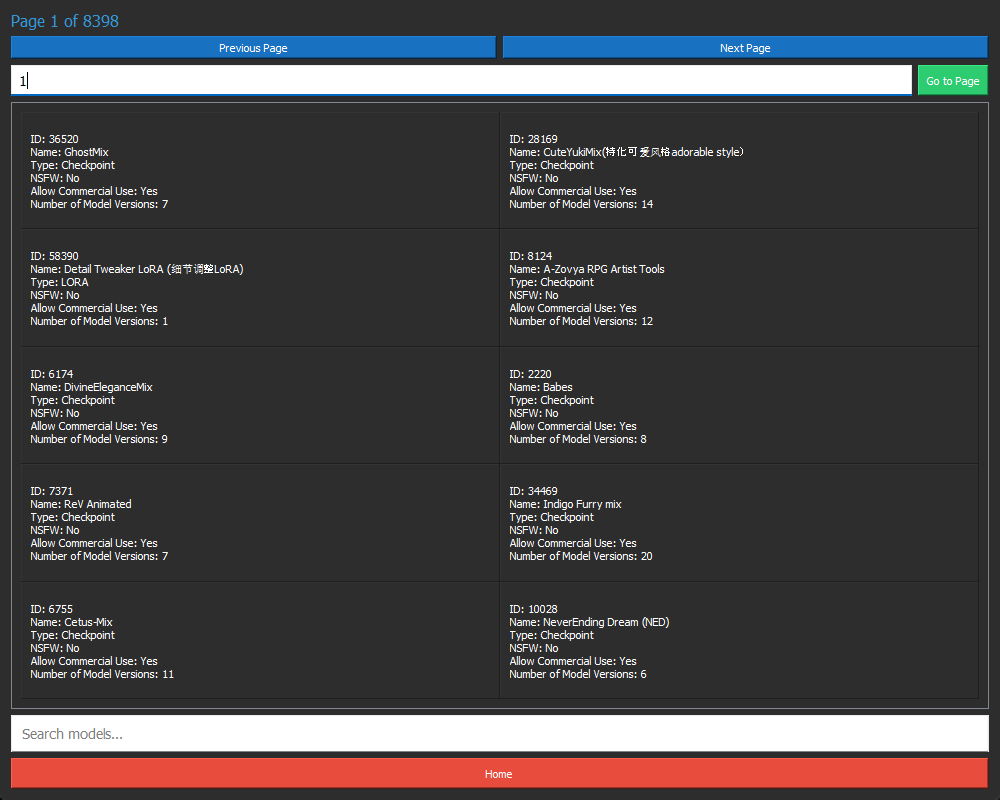

# CivitAI-Browser

## Getting Started

1. Run `install.bat` to let pip install all the necessary dependencies. Just sit back and relax while it does its magic.
2. Once the setup is complete, launch the CivitAI-Browser using `start.bat`.
3. You're now ready to embark on your AI model exploration journey!

## Notes

- Please be aware that threading is not implemented, so there might be some lag when you interact with buttons or other functionalities. We're working on improving this!
- Have fun exploring the fascinating world of AI models with CivitAI-Browser. Happy browsing! 🤖🔍

## Known Bugs

- *Crashes when dragged while loading*

## Screenshot(s)

